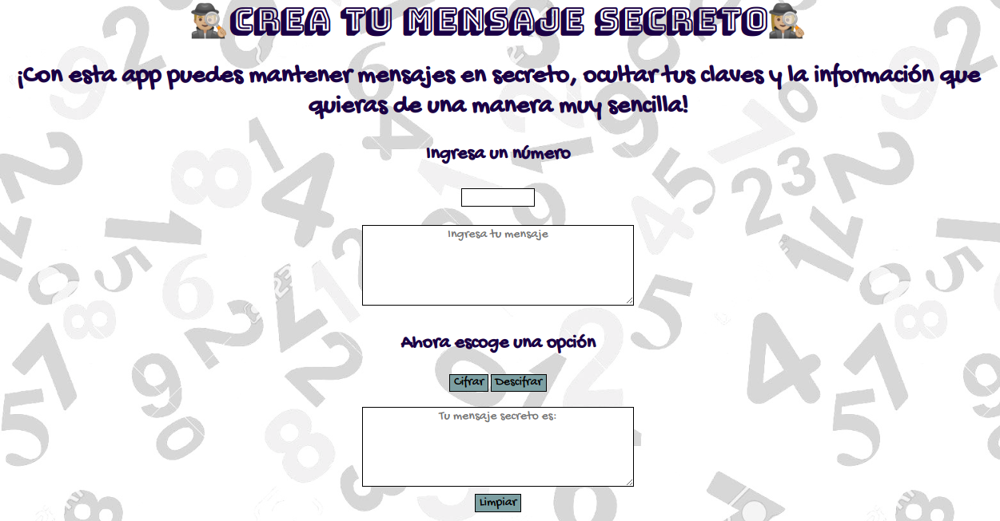
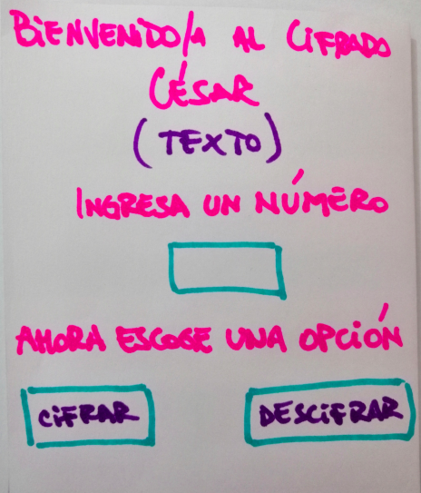
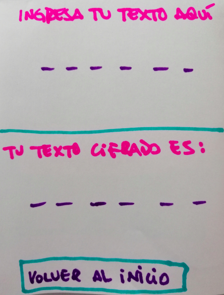
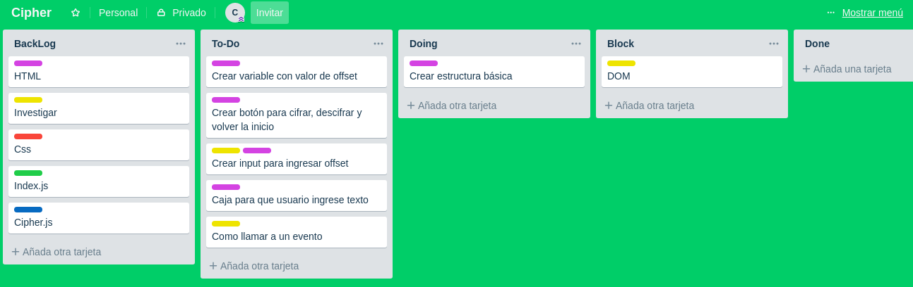

# Cifrado César

Estás aburrid@ de que lean tus mensajes? De no saber si la persona de al lado vió tu clave? Tenemos una solución a tu problema, que sin duda es el de muchos!!
En este primer proyecto se ha creado esta app con el fin de dar mas privacidad al usuario en cuanto a sus mensajes, claves, mails y lo que el/ella necesite mantener en "secreto".

## Pero... ¿Que es cifrar?

**Cifrar** significa codificar. El [cifrado César](https://matematicascercanas.com/2017/11/26/cifrado-sustitucion-codigo-cesar/) es uno de los primeros métodos de cifrado conocidos. El emperador romano Julio César lo usaba para enviar órdenes secretas a sus generales en los campos de batalla. 

Éste es un tipo de cifrado por sustitución, es decir que cada letra del texto original es reemplazada por otra que se encuentra un número fijo de posiciones (desplazamiento) más adelante en el mismo alfabeto.

Por ejemplo, si usamos un desplazamiento (_offset_) de 3 posiciones:

- La letra A se cifra como D.
- La palabra CASA se cifra como FDVD.
- Alfabeto sin cifrar: A B C D E F G H I J K L M N O P Q R S T U V W X Y Z
- Alfabeto cifrado: D E F G H I J K L M N O P Q R S T U V W X Y Z A B C

Muy simple...te parece?

## Resumen del proyecto

Esta app está orientada a público adulto, que maneje mails, varias claves o que simplemente quiera enviar un mensaje oculto a otra persona. Servirá para que el usuario pueda *cifrar y descifrar* un texto, indicando un desplazamiento específico de caracteres (_offset_) y como resultado obtendrá un mensaje totalmente distinto al entregado, de esta forma se cumple el objetivo esperado por el usuario al ingresar a esta aplicación, ya que de manera muy sencilla puede modificar palabras, claves y textos que él desee o necesite.

El tipo de usuario y su rango más bien generalizado, fue escogido ya que un joven, adulto generalmente maneja claves, mails, mensajes de importancia que realmente no pueden ser leídos por una persona anexa al destinatario. Es por eso que se pensó en una app que pueda codificar estos mensajes y así proporcionar privacidad de una manera muy fácil, con sólo ingresar un número y la palabra o texto deseado.

## Pero...¿Cómo se creó este proyecto?

Para comenzar, lo primero fue pensar bien qué se buscaba, cuál era el objetivo de ésta app, entonces se creó un flujo de trabajo y posteriormente un prototipo para tener una idea más física de lo que se quería proyectar más adelante.

Luego de crear el prototipo había que planificar paso por paso todas las tareas a seguir para comenzar el proyecto, esto se realizó con la herramienta trello.

Una vez hecha la planificación comenzó el proceso de crear la estructura de **html** de la app, luego **index.js**, **cipher.js** aplicando fórmulas y todo lo investigado. Dentro de la misma marcha del cifrado césar se fue modificando el prototipo ya que al ser pocos pasos para obtener el mensaje final, me di cuenta que no era necesario crear varias páginas con instrucciones, así que decidí hacer sólo una y que esta contenga dos cajas de texto para que el usuario codifique sólo "limpiando" la página. Una vez que logré cifrar y descifrar, le di forma y estilo a mi app con **css** logrando como resultado, la entregada al final de este proyecto.

## Experiencia de usuario

A continuación en [User Experience](https://www.youtube.com/watch?v=OJBvTW7ki2g&t=3s) podemos ver test de usabilidad para probar nuestra app.

Luego de ver el link, en la siguiente imagen podemos ver la palabra ingresada por el usuario, razón por la cuál en el video nos decía que su palabra cambiaba a EHEH.

<!--git origin master:gh-pages, enter
nuevamente usuario, enter
debe decir master->gh pages
en navegador escribir Carlar32.github.io/SCL009-Cipher/src/index.html
<!-- ## Consideraciones generales

